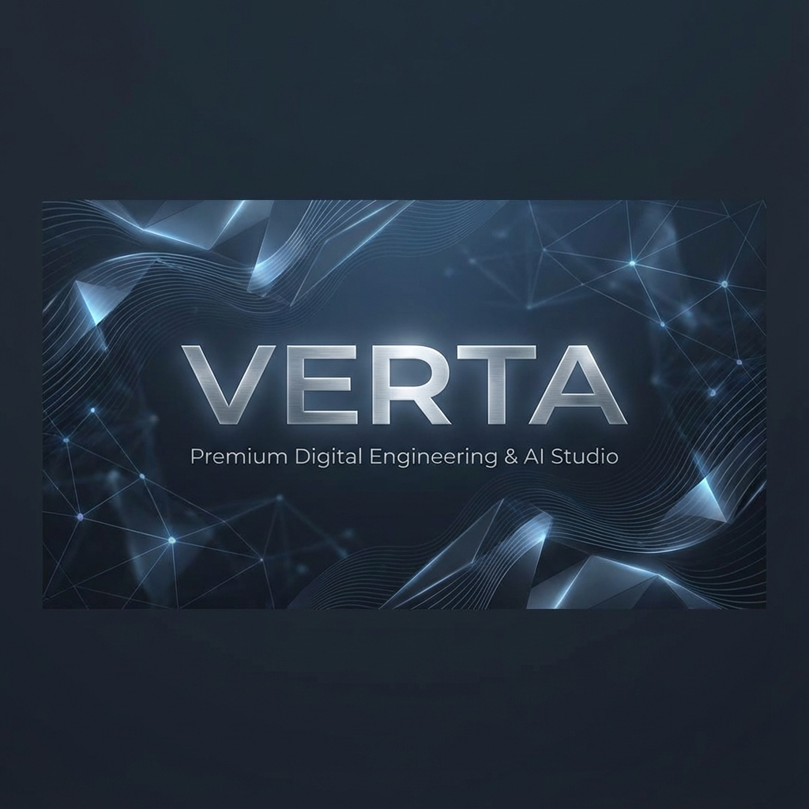

# Verta

**Verta** is a cutting-edge, interactive web experience designed to showcase modern digital capabilities. Built with **Next.js** and **Three.js**, it merges immersive 3D visuals with high-performance web standards to create a stunning user journey.

 <!-- Placeholder if they have one, or just leave it out/generic -->

## ✨ Features

- **🧊 Immersive 3D Experience**: captivating 3D scenes and interactions powered by [React Three Fiber](https://docs.pmnd.rs/react-three-fiber) and [Drei](https://github.com/pmndrs/drei).
- **🎨 Modern Aesthetics**: A sleek, premium design system implemented with [Tailwind CSS v4](https://tailwindcss.com/).
- **🎭 Fluid Animations**: Seamless page transitions and micro-interactions using [Framer Motion](https://www.framer.com/motion/).
- **⚡ High Performance**: Built on [Next.js 16](https://nextjs.org/) (App Router) for lightning-fast load times and excellent SEO.
- **📱 Fully Responsive**: A mobile-first approach ensures a perfect experience across all devices.
- **🛡️ Type-Safe**: Robust codebase built entirely with [TypeScript](https://www.typescriptlang.org/).

## 🛠️ Tech Stack

- **Framework**: [Next.js 16](https://nextjs.org/)
- **Core**: [React 19](https://react.dev/)
- **Language**: [TypeScript](https://www.typescriptlang.org/)
- **Styling**: [Tailwind CSS v4](https://tailwindcss.com/)
- **3D Graphics**: [Three.js](https://threejs.org/), [React Three Fiber](https://docs.pmnd.rs/react-three-fiber)
- **Animation**: [Framer Motion](https://www.framer.com/motion/)
- **Icons**: [Lucide React](https://lucide.dev/)
- **Validation**: [Zod](https://zod.dev/)

## 🚀 Getting Started

Follow these steps to set up the project locally.

### Prerequisites

- Node.js (v18 or higher recommended)
- npm, yarn, pnpm, or bun

### Installation

1.  **Clone the repository:**

    ```bash
    git clone https://github.com/Verta-Builders/Verta-WEB.git
    cd verta
    ```

2.  **Install dependencies:**

    ```bash
    npm install
    # or
    yarn install
    # or
    pnpm install
    ```

3.  **Run the development server:**

    ```bash
    npm run dev
    ```

    Open [http://localhost:3000](http://localhost:3000) with your browser to see the result.

## 📂 Project Structure

```bash
src/
├── app/          # Next.js App Router pages and layouts
├── components/   # Reusable UI components (Hero, Scene3D, etc.)
├── lib/          # Utility functions and configurations
└── ...
```

## 📜 Scripts

- `npm run dev`: Starts the development server.
- `npm run build`: Builds the application for production.
- `npm start`: Runs the built production application.
- `npm run lint`: Runs ESLint to check for code quality issues.

## 📄 License

[MIT](LICENSE)
